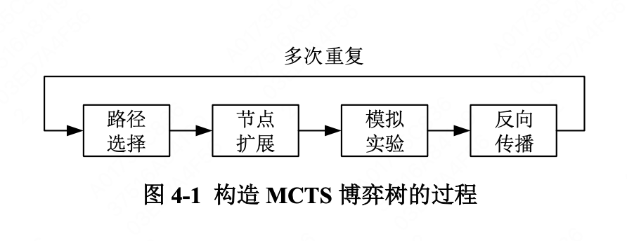
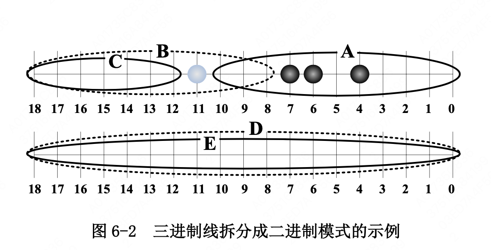
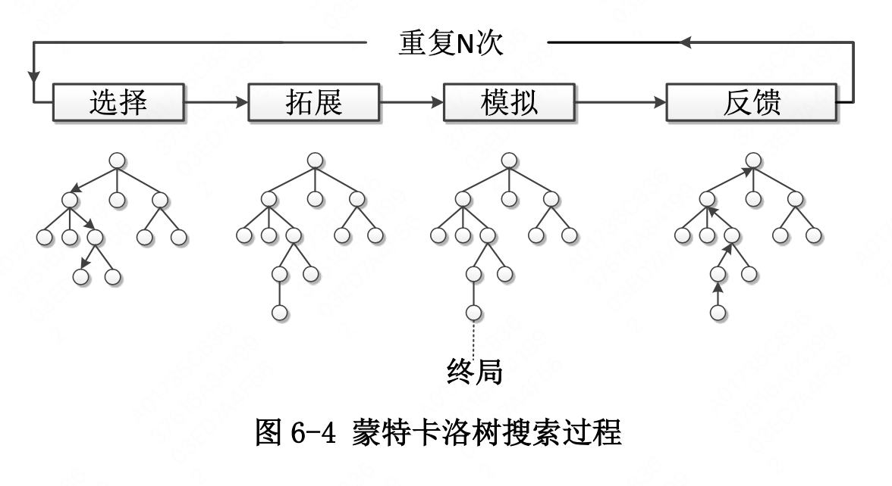
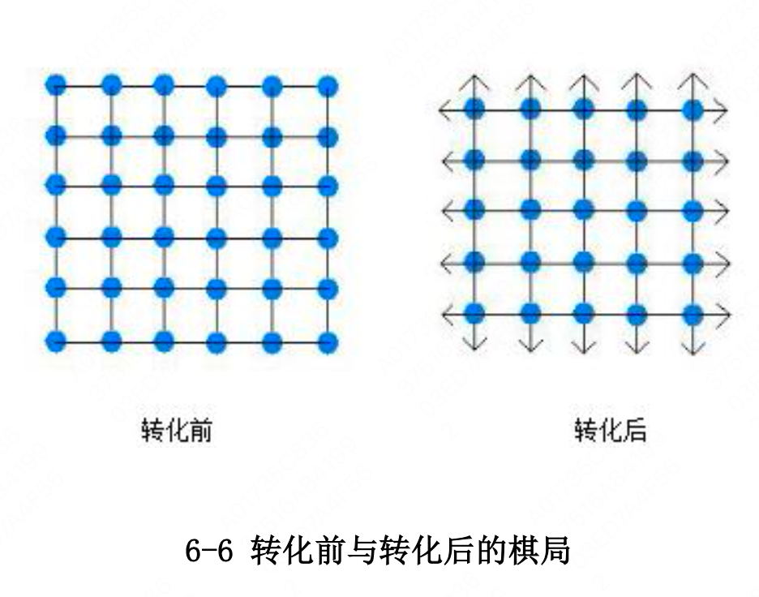
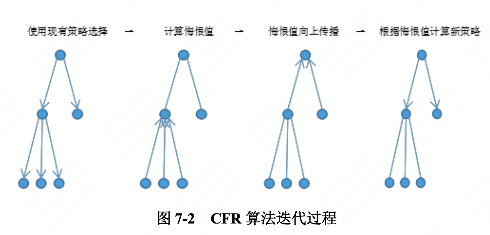

# 机器博弈阅读笔记

## 引言

机器博弈：Computer Games.

CG相关组织（负责博弈竞赛和学术交流）：

- ICGA
- 中国人工智能学会-机器博弈专业委员会

CG发展历史：

- 里程碑：1997年IBM深蓝战胜棋王
- 重要人物：
  - 陈志行教授：电脑围棋先行者
  - 许峰雄博士：组织深蓝课题组
- 国内发展：姗姗来迟但发展迅速。包括多种博弈竞赛、学术研究。

CG具有强大的生命力与产业化前景。可以应用到面对**决策优化**的各种场合，包括了经济、政治、军事、反恐、治霾和日常生活中无所不在的内容。

## 机器博弈的发展状况

### 机器博弈历史

- 1928年，冯诺依曼提出**极大极小值定理**，证明了博弈论的基本原理 。
- 1944年，冯诺依曼和摩根斯特恩将**博弈论系统应用于经济**领域，奠定了机器博弈研究的理论基础。
- 从上个世纪50年代开始，许多数学家和计算机学家都为计算机博弈做出了非常重要的贡献。这其中包括了多种棋类游戏的程序化博弈。
- 上个世纪八九十年代，随着计算机硬件与软件水平的发展，计算机在博弈类比赛当中逐渐反超人类。
- 步入**人工智能**时代之后，谷歌、腾讯、百度等企业都在机器博弈的领域当中取得了很好的成果，开发出了一些具有较高智能水平的产品，如**AlphaGo、绝艺**等。

### 研究现状

机器博弈是人工智能的「果蝇」。

#### 国外研究现状

早期研究：
- 建立有效、快速的**评价函数**和**方法**
- 在博弈树上更准确地找出最优解 -> **搜索算法**

随后的博弈技术：基于计算机博弈搜索和评估
- 极大极小搜索
- 负极大值搜索
- Alpha-Beta剪枝
- 并行搜索算法

新的突破：**深度学习**
- 基于 **深度信念网络DBN** 非监督的逐层贪心训练算法
- 与**并行计算**、**人工神经网络**的融合

机器博弈产品：
- **AlphaGo**：**完备信息博弈**的代表，DL与CG的结合。
  - 棋感直觉-深度学习网络🛜：通过3000w棋局学习得到。
    - 落子棋感-快速走棋网络🛜
    - 胜负棋感-策略网络🛜：不断自对弈
  - 搜索验证-蒙特卡洛搜索树🌲
- **Libratus**：德州扑克博弈，**不完备信息博弈**的代表。
  - 赛前Nash Eq近似：
    - 抽取博弈信息（如针对某一手牌的战略），应用强化学习。
    - 蒙特卡洛反事实遗憾最小化：自己学习。
  - 残局解算：
    - 自底向上构造博弈树🌲
    - 使用蒙特卡洛方法，更新上面的策略：能在比赛中学到东西。
  - 持续自我强化：
    - 发现赛中的问题，进行自我强化，得到更好的Nash eq。

#### 国内研究现状

国内计算机博弈研究相对起步较晚，近几年，学者们结合棋牌各自特点，针对计算机博弈**搜索**、**评估**与**优化**等方面开展了深入研究：

- 对于局面估值问题：
  - 提出结合时间差分算法和反向传播神经网络，设计一种局面估值算法实现评估函数参数的自动调整;
- 针对六子棋：
  - 东北大学徐长明：局面表示等关键技术
  - 重庆理工大学张小川教授：应用遗传算法优化评估函数
  - 安徽大学李学俊教授等：基于局部“路”扫描方式的博弈树生成算法;
- 针对中国象棋：
  - 东北大学王骄教授：计算机博弈开局库、循环判定规则、评估函数参数组的自动调整和优化
- 针对苏拉卡尔塔棋：
  - 北京信息科技大学李淑琴教授等：根据棋子的数量、移动范围等不同参数，对局面评估函数进行了研究;
  - 辽宁石油化工大学张利群教授：网络博弈平台吃子算法;
- 针对亚马逊棋：
  - 沈阳航空航天大学邱虹坤等：对搜索算法进行了分析
  - 李淑琴教授：根据特征权重值给出一个分阶段的评估函数;
- 中央民族大学李霞丽和吴立成教授：提出一种围棋多模态算法，及基于小样本的藏棋博弈算法;
- 针对德州扑克等博弈系统：
  - 哈尔滨工业大学王轩教授团队：非完备信息机器博弈中风险及对手模型的研究。

### 产业现状

机器博弈不仅在学术界掀起了对其研究的热潮，还带动与之高度密切相关的**游戏产业**飞速发展。

- **产业产值**：全球2016年移动游戏的收入达到 415 亿美元，预计 2020 年将增至 746 亿美元。2016 年中国游戏整体营收超过 1400 亿人民币，超过 美国和日本，成为世界最大游戏市场。另外，国家对电子竞技的发展给予了大力支持。
- **学术界与游戏产业界结合**：北京邮电大学刘玉璋教授创建的新睿桥牌机器人、重庆理工大学张小川教授带领团队研制的斗地主全国冠军引擎
- **其他产业**：军用无人机系统自主智能决策与控制、智能化战争模拟(兵棋推演)系统、军用信息系统智能化。

### 问题与展望

**问题：**

- 非完备信息博弈的相关研究不成熟，有很大的提升空间。
- 产学研结合不足，企业缺少专业人才，专家学者缺少企业资金支持。
- 总体上，与国外有较大差距，特别是在非完备信息和不确定性机器博弈方面。

**展望：**

- CG与并行计算、大数据、知识工程等相关技术结合
- CG应用于智能硬件产品，如机器人、无人驾驶
- 融入其他领域的应用当中，如经济、医疗、航空航天。
- 高度智能化趋势，与GA、ANN、类脑思维等人工智能技术进一步融合。
- 研究通用的博弈技术。
- 学术界与产业界更加紧密结合。

## 博弈的复杂度

### 概述

博弈的复杂度包括了两个方面：
- 状态复杂度
- 博弈树复杂度

### 状态复杂度

**博弈过程的局面**称之为状态。状态复杂度指从初始局面出发，产生所有合法局面的总和。

换句话说，我们看一颗博弈树🌲，那它就有节点。那么状态复杂度指的就是，这样的结点可能有多少种。

举一个例子，假设有这样一个假想游戏：

> 4x4的棋盘格，黑白双方轮流下子，先把棋盘占满的赢。

在16个格子当中，每个格子可能有空白、黑子、白子三种情况。则可能有 $3^{16}= 43,046,721$ 种局面，或者说博弈树有这么多种节点。这个例子的状态复杂度就是 $3^{16}$

当然，在真正的游戏当中，具体的规则可能会让某些局面无效。例如在白皮书中举的亚马逊棋、苏拉卡尔塔棋的例子。

### 博弈树复杂度

**博弈树**是一颗根在上叶在下的树，分若干层，每一层代表某一走棋方可以走出的合法局面。

对于只添子的游戏（如五子棋），树的各个节点互不相同；对于存在移动棋子的游戏，树中可能存在相同的节点（局面）。

**博弈树搜索算法**：常用于完备信息的博弈系统（博弈树是确定的）。通过估值函数评价各个局面（非叶节点）的优劣，找到最佳走法。

**解决树**：得到理论解所需展开的最小搜索树。

**博弈树复杂度**是指从初始局面开始，其解决树的所有叶子节点的总和。

估算方法：
- 平均分支因子 (如:围棋、中国象棋、亚马逊棋、六子棋等)
- 蛮力搜索 (如:tic-tac-toe)

#### Case Study：六子棋

六子棋的**平均博弈深度**为30层。

第1步有361点可下，第i步有 $C_{364-2i}^2$ 个点可以下。棋盘上连6的局面有952种情况。从第6层开始，产生的节点数要扣除连6。于是

$$
\begin{align*}
    countNodes(6) = 361\times C_{360}^2\times\dots\times C_{352}^2-952\\ 
    countNodes(n) = countNodes(n-1)\times C_{364-2n}^2-952
\end{align*}
$$

这样算出来大概是上限 $10^{145}$.

### 博弈问题的计算复杂性

- EXPTIME-complete 问题：国际象棋和西洋跳棋
- PSPACE-hard问题：围棋
- PSPACE-complete问题：五子棋、六子棋、奥赛罗棋、亚马逊棋

## 机器博弈的典型技术

### 穷尽搜索

- 极大极小搜索
- 负极大值搜索：在极大极小搜索上的改进，把极小节点值(返回给搜索引擎的局面估值)取绝对值，这样每次递归都选取最大值。

### 裁剪搜索

aka **剪枝算法**。

- Alpha-Beta剪枝：在极大极小搜索上的改进算法，是其他剪枝算法的基础。多数采用负极大值形式的AB搜索算法。可能需要调整树的结构，对搜索结点排序，确保迟早剪枝。
- 渴望搜索：在AB搜索的基础上，缩小搜索范围。从一开始使用小窗口，在搜索之初进行大量剪枝。通常与遍历深化技术结合，提高性能。 
- MTD(f)搜索：不断应用零窗口的AB搜索，缩小上下界。简单高效，表现出色。
- 其他优化算法。
  - 在🌲的同层结点当中，用BFS，接力空窗探测。avg搜索效率高于mtdf。

通常，裁剪算法需要与**置换表**技术结合，减少树的规模，提高搜索效率。

### 启发式算法

**启发**（Heuristic）指通过排序让AB剪枝的搜索树尽量接近最小树，优先搜索好的着法。通常有：

- 置换表启发
  置换表是一个大的直接访问表，存储已经搜索过的结点（子树）的结果。类似于记忆化搜索。常用Hash表或者ZobristHash技术实现。
  - 优点：提高搜索效率
  - 缺点：当树的深度很大，对内存空间的要求巨大。通常为置换表分配有限大小，采用散列方式管理存取。
  置换表启发是将置换表与AB剪枝结合的产物，如在中国象棋等棋种中，用来增强搜索效率。
- 历史启发 HH
  也是基于ABS对节点排列顺序敏感的特点，维护着法的历史，每当遇到好的着法，就给其历史得分一个增量，提高其优先级。
- 杀手启发 KH
  viewed as 历史启发的特例。同层引发剪枝最多的节点为killer。下次搜索到同一层时，优先搜索杀手。
  杀手启发可以对着法进行动态重排序，提高置换表的使用效率。

研究表明，HH与置换表结合可以大幅减少博弈树空间。在残局当中应用KH可以明显节约时间。

### 迭代深化

aka **遍历深化**。是一种常用的蛮力搜索机制，用于DFS。

迭代深化利用ABS对子节点排序敏感的三点，使用上次迭代得到的博弈值，作为当前迭代的搜索窗口估值，以此作为启发式信息计算当前迭代的博弈值。

它利用时间控制遍历次数，只要时间一到，搜索立即停止。在关键的开局和残局，由于分支较少，可以进行较深层次的搜索。

ABS经过置换表、HH、迭代深化等技术增强后，性能可以大幅提高。

### 最佳优先算法

最佳优先算法**不受节点排序的影响**，其搜索树小于DFS的最小树。不过仍然在理论研究阶段。

最佳优先算法分为两类：

- 基于极大极小算法取值的**SSS\*和DUAL\***
  都属于状态空间搜索，把极大极小树看成状态图，在不同的分支上展开多条路径，并且维护一个关于状态图的全局信息表。
  这两种算法是两个操作相反的过程，前者在搜索深度为偶数的极大极小搜索中表现较佳，后者则在深度为奇数搜索中较佳。
  SSS*和 DUAL\*算法都过于复杂，且时间和空间开销较大，实际应用较少。
- **B*和 PB\*算法**
  - B\*算法用一个乐观值和一个悲观值来评价节点。当根节点的全体悲观值都大于等于其他的乐观值，B*算法结束。
  - PB\*算法就是基于概率的 B*算法，这个算法对概率的准确估计比 较敏感，实现困难。

### 随机搜索

有两种算法：**拉斯维加斯算法**和**蒙特卡罗算法**。采样越多，前者越有机会找到最优解，后者则越接近最优解。在计算机博弈中，每步着法的运算时间、堆栈空间都是有限的，且仅要求局部优解，适合采用 蒙特卡罗算法。

- 蒙特卡洛树搜索：MCTS
  MCTS结合了随机模拟的一般性和树搜索的准确性。理论上，MCTS可以用在以{状态，行动}定义并用模拟预测输出结果的任何领域。
  主要的过程：
    
  适用：
  - 非完全信息博弈
  - 较大分支因子的博弈：如AlphaGo。
- UCT搜索
  上限置信区间算法（UCB for Tree）。基于MCTS发展的，扩展UCB到极大极小树搜索，将MCTS与UCB结合产生。

### 并行计算

在机器博弈中，运用**并行技术**把博弈树动态分开，同时执行多个指令，可以在不裁剪和缩小博弈树的规模情况下，提高搜索、 训练、分析的速度，优化系统性能。主要有两种体系：

- **单机体系** SMP(Symmetric Multiprocessor)：多进程并行。可以共享storage。博弈搜索通常需要用到置换表，故适合采用基于 SMP 方式的多线 程并行计算。
- **分布式体系** Cluster(计算机集群)：多机并行。用于深度神经网络模型训练中，达到快速训练深层模型的目的。

### 遗传算法

一种非数值、并行、随机优化、搜索启发式的算法，通过**模拟自然进化过程**随机化搜索最优解。

基本思想：将博弈树看作遗传操作的种群，博弈树中由根节点到叶子节点 组成的所有子树为种群中的个体。根据优化目标设计评估函数，计算 种群中每个个体的适应度函数值，依据适应度函数值的大小确定初始种群，让适应性强(适应度函数值大)的个体获得较多的交叉、遗传 机会，生成新的子代个体，通过反复迭代，可得到满意解。

在实践中，遗传算法被引入了中国象棋、国际象棋、亚马逊棋以及禅宗花园游戏等博弈系统的智能搜索与评估优化中。

### 神经网络

一种运算模型，由大量的节点(神经元)之间相互联接构成。

每个节点代表一种特定的输出——**激励函数**(Activation function)。每两个节点间的连接都代表一个对于通过该连接信号的加权值，这相当于人工神经网络的记忆。

网络的输出则依网络的连接方式，依权值和激励函数的不同而不同。而网络自身通常都是对自然界某种算法或者函数的逼近，也可能是对一种逻辑策略的表达。

### 机器学习

机器学习的根本任务是**数据的智能分析与建模**。机器学习用大量数据进行训练，使用各种算法来解析数据并从中学习，做出决策和预测。当前主流机器学习技术包括度量学习、多核学习、多视图学习、集成学习、主动学习、强化学习、迁移学习、统计关系学习、演 化学习、并行机器学习、哈希学习等。

**强化学习**研究学习器在与环境的交互过程中，如何学习到一种行为策略，以得到累积利益最大化。在机器博弈中，学习器所处的环境为博弈规则，学习器根据当前博弈状态输出着法，以博弈收益作为每步着法的结果，反馈给学习器，以期望最终的利益最大化。强化学习的优化目标通常相对复杂，且策略的搜索空间巨大，优化困难。另外，强化学习还面临着特征表示、泛化能力等诸多挑战。

**深度学习**是基于多层网络结构的特征学习方法，把原始数据通过多层神经网络非线性变换，逐层提取抽象特征，完成复杂的目标函数系统逼近。深度学习能够学习多层次抽象的数据表示，能够发现大数据中的复杂结构，对于解决强化学习中策略评估和优化的问题有明显优势。深度学习被成功地用于机器博弈中，如AlphaGo。机器学习拓展应用方面仍面临一些问题，例如深度学习训练耗时、非凸函数模型在理论研究中存在困难等。

## 机器博弈平台技术

计算机博弈平台系统本身并**不具有**下棋或出牌的逻辑决策功能，但是它可以**加载**其它一个或多个决策**引擎**程序，使这些引擎程序以选手的角色参与对局。

包括以下几个部分：

- 输入模块、
- 逻辑计算模块、
- 输出模块

### 不同的分类

- **信息差异程度**：完备/不完备信息博弈
- **引擎数量**：单引擎（人机）/ 多引擎
- **联网**：单机/网络博弈平台
- **结构**：程度级/模块级

### 计算机博弈平台的设计规范

**人机交互接口规范：**

- 显示输出规范：醒目地突出棋局或牌局的重要信息，考虑颜色、对比度、分辨率、或者图案心理因素等对操作者的影响
- 操作输入规范：符合大众的操作习惯，比如用鼠标的定位和点击左键实现棋子的拾取、落下。
- 其它约定规范：计算机博弈平台应对引擎决策耗时进行记录和统计，并及时显示用时情况。还应对引擎超时或异常、不当操作引起的错误做出相应判罚。

**平台与引擎通信的协议规范：**

- 对局状态和过程的信息编码
- 引擎与博弈平台的通信协议
- 引擎示例代码

### 博弈平台相关技术

- 匿名管道通信技术：管道是一种进程间的通信机制。博弈平台启动引擎进程，并创建管道与引擎之间进行通信。
- 数据保存和加密技术：记录对局过程和结果，用于局面重现和分析测试。采用对称式的加密技术。
- 在线对局技术：通过 TCP 或 UDP 协议与远程的引擎建立数据通信。

### 博弈平台应用实例

- 哈尔滨理工大学军棋博弈平台系统
- 哈尔滨理工大学二打一(斗地主)博弈平台系统
- 北京理工大学苏拉卡尔塔棋博弈平台系统
- 沈阳航空航天大学通用计算机博弈对战平台

## 完备信息博弈专项技术

### 六子棋

#### 知识表示

使用的是「棋盘-三进制线-二进制模式-点」的分层表示方法。

处理六子棋的一个比较重要的环节是将三进制（黑、白、空）的线**等价分解**为二进制（有子、无子）的模式。如下图所示（圆的组合表示了一个分解）。

  

全部的棋形有1,048,512 个，可以划分为15个等价类。

#### 搜索和推理

- 常见搜索策略：
  - AB搜索 
  - UCT 策略：基于探索与利用均衡的抽样方法来弱化对专家估值需求
- **更有效**的搜索：
  - 证据计数搜索 PNS (Proof Number Search)：一种最佳优先搜索策略，尝试以尽可能低的状态空间复杂度给出关于赢/不赢这类二元问题的肯定或否定的解答。
  - 迫着空间搜索 TSS(Threat Space Search)：一种 基于回答特定问题而根据规则进行剪枝的高效搜索算法，这种剪枝是无风险的。是六子棋程序的必备选项之一。

在分层表示的情况下，**增量更新**是一种非常有效的状态演化方法，在实践中常被采纳。

#### 机器学习

六子棋的机器学习相比于围棋有更多优势：
- 基于分层描 述的六子棋知识表示，在策略(policy)表达上比围棋更容易
- TSS 有助于构建大规模有监督的训练集。
- 六子棋基础知识库较小，可以围绕该知识库，通过学习，扩展和构建实用的高级知识的知识库。

六子棋思路，可以参考AlphaGo，采用**深度学习、强化学习、UCT技术**。

### 围棋

#### 主要方法

##### UCT方法

基于蒙特卡洛的UCT算法，全名为UCB for Tree。

UCB (Upper Confidence Bound) 最初用于解决老虎机🎰吃角子问题提出。有计算公式：

$$
Gen_i = X_i+\sqrt[]{\frac{2\ln N}{T_i}}
$$

其中， $Gen_i$ 表示第i台机器的新收益， $X_i$ 表示目前的平均收益， $T_i$ 表示机器i目前玩过的次数。 $N$ 表示全部机器玩过的次数。

UCT将UCB的公式用于**围棋的全局搜索**当中，是一种**最佳优先算法**。把每个叶子节点都当成一个老虎机吃角子问题，收益由执行随机对弈的模拟棋局得到， 胜负结果将更新树中所有节点的收益值。UCT 算法不断展开博弈树 并重复这个过程，直到达到限定的模拟对局次数或耗尽指定时间。收 益最高的子根节点成为 UCT 算法的最终选择。

UCT 搜索过程使用 UCB 作为博弈树展开的依据，利用蒙特卡洛过程进行叶子节点的评价，评价值回溯并更新展开的子 树，作为节点的收益。

  

##### 深度学习与UCT结合

AlphaGo 中，利用深度学习的方法训练了两个网络，**策略网络和估值网络**。两个网络的训练过程都包括两步，即**监督学习**(学习专家棋谱)和**增强学习**(自博弈)。

**策略网络**：输入一个局面，给出一个招法(实际上给出所有走子点的概率排列，需要保证随机性，并不是一直选最大概率的招法)。
**估值网络**：输入一个局面，给出评价。

AG里面用了两个PN（一个复杂，一个简单但快），一个VN。AG的搜索框架改进了UCB，加入了先验概率，由复杂PN给出，简单PN用于蒙特卡洛模拟过程。叶子节点进行蒙特卡洛模拟过程的同时，也用VN进行评价，模拟过程的结果与VN给出的评价加权求和，作为最后的估值。搜索树的更新过程与传统的UCT也是类似的。

### 点格棋

#### 棋盘表示

- **矩阵表示法**：将棋盘表示为6x6的点阵数组，一个2x2的子点阵为一格。每个格子被四条边围住时，格子被俘获。
- **十字链表示法**：更好匹配且高效。将棋盘进行转换，核心观点是把格转换成点。如下图所示。棋盘有30条横边30条竖边，各有存在和删去两种状态，因此可以用2个int H，V表示。因此，可以用(H, V, S0, S1)唯一表示一个棋局。

  

#### 估值函数

大多数 AI 程序使用的是静态估值，即按照已知的策略和技巧对棋局评估。

也有利用**ANN**进行估值，设计 ANN 模型的关键之处在于选择合适的局面特征使其可以 反映出局势情况的内在规律。特征主要有两种方案：

- 使用原始局面，压缩后作为输入。——输入信息过大，网络规模大，运算速度慢，且内在规律不明显，训练难度大
- 统计局面当中链、环等信息，抽象为易于人类分析的形式。——存在信息丢失，但是模型节点数较少，计算速度快，规律明显，训练难度低

#### 搜索技术

- AB剪枝。迭代加深、置换表、启发式算法
- 蒙特卡洛树搜索
- 集成深度学习，引入CNN

1. **UCN结合ANN**
   ANN 具有近似估 计局面优劣的特性，对叶子节点的评估上，可近似计算出可能的双方获胜概率。UCT 算法通过大量模拟，在线学习的方式来判断走法好坏。UCT 与 ANN 的结合使 用，一定程度上减少了模拟时间，而准确性上不会有太大损失。
2. **CNN结合AB搜索**
   CNN可以给出对一个游戏局面的评估，但是精度不足。当被搜索局面的回合数处在卷积神 经网络的置信回合区间中时，卷积神经网络模型将直接充当Alpha-Beta 搜索的局面评估函数，提高效率。
3. **CNN结合MCTS。**

### 爱恩斯坦棋

用一个5x5的矩阵表示棋盘。棋格当中**20+num**表示红棋，**10+num**表示蓝棋，**0**表示无棋。

#### 搜索算法 

- **期望搜索算法 EMA**
  在传统的极大极小算法当中引入概率，即期望搜索算法。相比于传统的minimax算法，在max层和min层之间加入chance层，用来评估投骰子随机事件发生的期望，计算方式是取其子节点的加权平均效用。
  期望搜索算法通过对对手下一步行棋的预测评估来解决搜索过程中的随机性问题，将其转换为可以计算量化的概率问题，使得能够构建博弈树并进行搜索。
- **攻防兼备的期望搜索算法 ODEMA**
  结合了EMA，在max层和min层加入dice层模拟，综合进攻和防御双方面的考虑，设计了进攻性估值、防御性估值、威胁度估值三个方面。
  ODEMA 所构造的博弈树并不是一颗标准的完全 博弈树，在博弈树搜索扩展过程中，随时可能出现末端结点即棋局结 束。对于这些末端结点的估值就需要进行特殊对待。

## 非完备信息机器博弈技术

非完备信息机器博弈问题是一个**NP难问题**。

### 德州扑克博弈

主要算法有**CFR算法**和**DeepStack算法**。

#### CFR 

Counterfactual Regret Minimization. 算法的核心在于博弈当中的**纳什均衡探寻**。这是从在线学习当中引入了**悔恨值**：

$$
\boldsymbol{R}_{i}^{T}=\frac{1}{T} \max _{\sigma_{i} \in \Sigma_{i}} \sum_{i=1}^{T}\left(\boldsymbol{u}_{i}\left(\sigma_{i}^{*}, \sigma_{-i}^{\prime}\right)-\boldsymbol{u}_{i}\left(\sigma^{\prime}\right)\right)
$$

$\sigma _i^t$ is the strategy that player i applies in round t, and u is utility. RM算法将每步策略的收益与平均收益比较，得到差值。根据差值选择下一步的策略。在ZSG中，如果双方的avg R 均小于  $\varepsilon $, 可以看成达到了一个 $2 \varepsilon $ 均衡。   

CFR算法与普通的RM算法不同之处在于，其将平均悔恨值分解为一系列的**可加悔恨值项**，即**反现实悔恨值**(counterfactual regret)，因此可以**分别**进行最小化。反现实悔恨值定义在独立的信息集上，而平均悔恨值受限于反现实悔恨值之和。

对于信息集I当中每个可选行动a，玩家i在时间T的CFR公式发如下所示。

$$
R_{i}^{T}(I, a)=\frac{1}{T} \sum_{t=1}^{T} \pi_{-i}^{\sigma^{\prime}}(I)\left(u_{i}\left(\left.\sigma^{t}\right|_{I \rightarrow a}, I\right)-u_{i}\left(\sigma^{t}, I\right)\right)
$$

where  $\pi_{-i}^{\sigma^{t}}$ 是除玩家i之外的其他玩家依据策略sigma到达当前信息集的概率。

  

还有一种针对**一对一有限**德州扑克的求解算法，**CFR+**。CFR 算法截取博弈过程的一部 分进行迭代，而 CFR+算法对整棵博弈树迭代，且规定悔恨值必须为正。

#### DeepStack算法 

DeepStack解决的是**一对一无限注**的问题。

有三个部分组成：

- 针对当前公共状态的本地策略计算(local strategy computation) 
- 使用任意扑克状态的学习价值函数实现有限深度的前瞻(depth-limited lookahead) 
- 以及预测动作的受限集合

DS还应用了**DNN**，得到各个玩家在各种手牌的情况下评估值组成的向量。

### 军棋

在军棋博弈技术中重点需要解决以下三个问题:
- 对手棋子可能性矩阵更新问题;
- 欺诈走法的选择和判定;
- 搜索技术的选择。

#### 对手棋子可能性矩阵更新

随着棋局的变化，棋盘上的棋子分布概率也会发生一些变化。也就是棋手手上的**棋子初始可能性**。

**信念传播算法**是一种迭代求解概率图模型的推理方法。该算法精髓是计算局部消息传递，从而可以计算结点的边缘概率分布。当裁判给出信息之后，比如棋子碰撞之后，所得结果为胜、负、 平，该结果信息对于对手发生碰撞的棋子的可能性有一定影响，会间接影响到对手其他棋子的可能性。通过信念传播算法可以较好的解决可能性更新的问题。

#### 欺诈走法的选择和判定

**欺诈走法**不能直接获取利益，但是可以让对手判断失误，在战略上获得主动。

在人机博弈中，只有建立欺诈数学模型并且结合搜索技术求解、实现可以实施欺诈走法和判定欺诈的AI，才能够战胜人类。

#### 搜索技术的选择

很多非完备博弈程序都直接或者间接的使用直接转换的方法，生成一个基于当前的**信息完备局面**，再进行着法搜索。

**确定性聚合 UCT 算法**是通过对多种状态空间(即多个可能的完备信息棋盘状态)进行搜索。虽然前中期搜集到的棋盘信息不充分， 但是可以对可能局面进行抽样，根据已搜集到的少量信息，排除不可能局面，留下可能性高于阈值的局面。针对每个局面使用 UCT 算法进行搜索，求解每个局面行棋着法的胜率，再根据该局面可能性权重加权求和，取最大聚合胜率的行棋着法为行棋策略。

### 桥牌机器博弈

桥牌的博弈过程可以归纳为三个方面: 

1. 信息收集、分析、传递与对抗; 
2. 同伴之间的合作协议设计(包括叫牌规则和防守信号);
3. 计划、决策实施与计划调整，做出叫牌和打牌计划，并根据实施过程中的情况及时调整。

桥牌的问题规模很大，常规的暴力搜索不能解决。

#### 双明手算法

如果在一副牌完全确定的情况下，即包括四家的牌、庄家、定约都是知道的，称之为双明手。双明手情况下的打牌就变成了一个**完整信息的搜索最优解**的过程。

结合桥牌专家技术，利用 Alpha-Beta 剪枝、哈希表、单套分析等技术，绝大部分牌例都能够在很短的时间内得到结果。

双明手算法的突破是目前解决桥牌机器博弈的**基础**，它把不确定性的问题转换为基于不确定性的猜想进行确定性的计算。

#### 蒙特卡洛抽样模拟

利用叫牌和打牌过程的信息，可以对其它各家的牌进行抽样分析，得到若干个牌面明确的样本，对每个样本再使用双明手算法获得确定的结果，进而得到在当前局面下叫牌和出牌回报的数学期望。同时有效向同伴提供信息、对敌方隐藏甚至提供欺骗信息是桥牌获胜的重要技术。

**信息既有对抗又有合作**，这也是目前其它棋牌机器博弈中不具备的特点，是未来桥牌 AI 战胜人类必须突破的关键点。

#### 专家系统

主要体现在**叫牌体系**的设计上。一套优秀的叫牌体系设计，能够让同伴获得更清晰的信息，并且减少敌方获取更多我方信息。

常见的做法是基础的框架采用**专家编写叫牌博弈树**，AI 查表，后期采用**蒙特卡罗模拟结合自然叫牌规则**实现。

#### 桥牌博弈技术的未来

桥牌 AI 的发展，以下几个方向值得探索: 

- 信息收集分析和置信度的动态调整，提升蒙特卡罗抽样模拟的有效性; 
- 降低学习的状态空间，使得向人类牌手学习乃至自博弈的增强学习成为可能;
- 学习德州扑克 AI 的成功经验，建立对手模型和伙伴模型; 
- 通过机器自博弈，找到一套最佳的叫牌、打牌约定系统。

## 机器博弈国内外赛事

### 国际赛事

- 国际象棋人机博弈大赛
- “UEC 杯”世界计算机围棋比赛
- 世界计算机桥牌锦标赛
- 计算机扑克程序比赛
- 国际计算机博弈比赛
- 五子棋 AI 比赛

### 国内赛事

- 中国象棋人机与机机博弈大赛
- 中国计算机博弈大赛