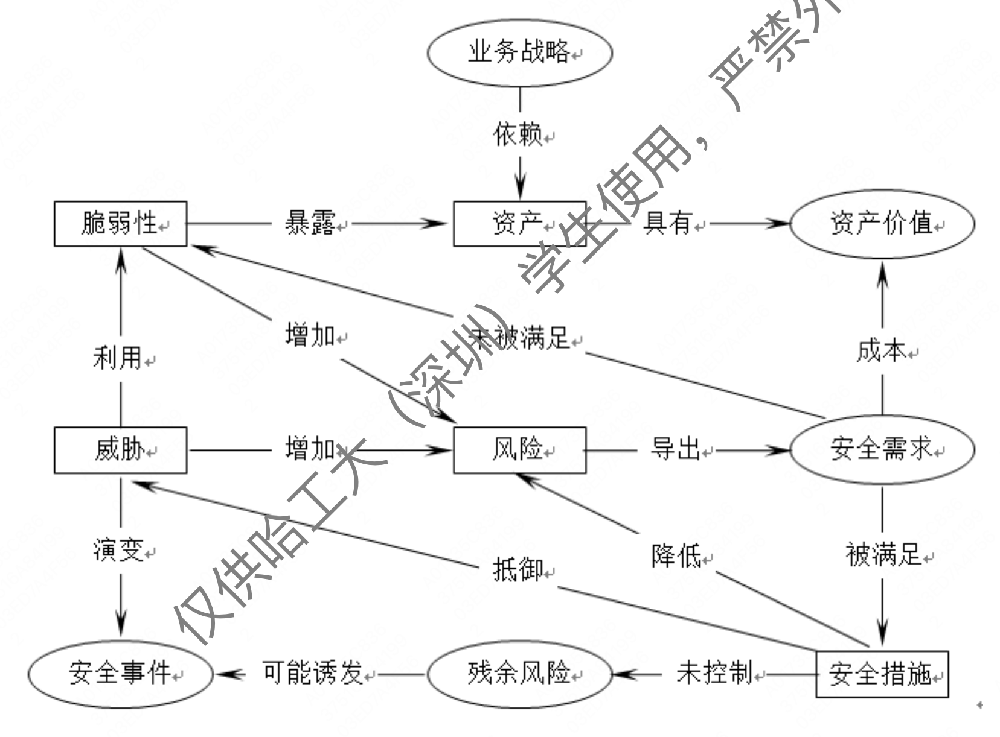
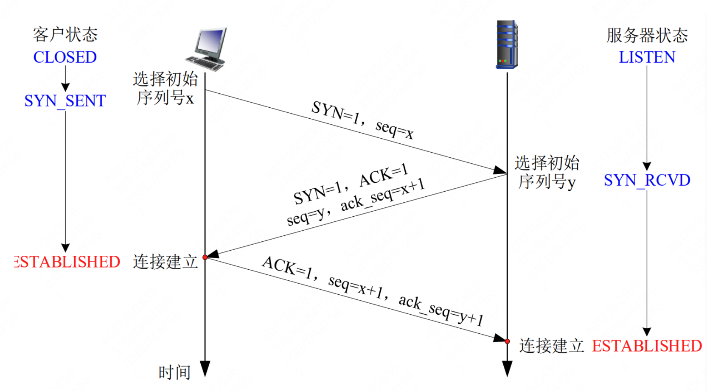

# 网安 作业2

200110611 王志铭 

 

> (1) 简述计算机病毒、蠕虫、木马、后门、Rootkit、以及勒索软件这几类恶意代码的工作原理。(5分)

- 计算机病毒：在计算机程序中插入的破坏计算机功能或者毁坏数据，影响计算机使用，且能自我复制。
- 蠕虫：主动扫描和攻击网络上存在系统漏洞的节点主机，通过局域网或者因特网从一个节点传播到另外一个节点。
- 木马：通过伪装成表面上有用的程序，背地运行某种有害功能的代码，达到入侵系统的目的。
- 后门：通过绕过安全控制而获取对程序或系统访问权。
- RootKit：一类木马后门工具，通过修改现有的操作系统软件，使攻击者获得访问权限并隐藏在计算机中。
- 勒索软件：通过劫持用户资产或资源并以此为条件向用户勒索钱财。

> (2) 简述微软软件安全开发生命周期 SDL模型的设计思想、各阶段安全活动和目的。(5 分)

- 设计思想：为了开发尽可能安全的软件，把安全活动融入到软件生命周期的各个阶段中去。
- 各阶段安全活动：
  1. 培训：安全培训
  2. 需求分析：确定安全需求、创建质量门、缺陷等级、安全/隐私风险评估
  3. 设计：确定设计要求、减少攻击面、威胁建模
  4. 实施：使用批准工具、弃用不安全函数、静态代码分析
  5. 验证：程序动态分析、模糊测试、威胁模型/攻击面分析
  6. 发布：事件响应计划、最终安全审核、发布/存档
  7. 响应：执行事件响应计划
- 目的：提高软件产品的安全性

> (3) 什么是软件逆向工程?有哪些常用的软件逆向分析方法和工具?(5 分)

- 软件逆向工程：一系列对运行于机器上的低级代码进行等价的提升和抽象，最终得到更加容易被人所理解的表现形式的过程。
- 方法：
  1. 动态逆向分析方法
  2. 静态逆向分析方法
  3. 动静结合的逆向分析方法
- 常用工具：调试器（IDE、操作系统、软件商提供）、反编译、反汇编工具（IDA Pro、C32Asm等）。

> (4) 应急响应过程可以划分为哪几个主要阶段?每一阶段的主要工作有哪些? (5 分)

1. 应急准备：建立应急响应组织、制定应急响应制度、风险评估与改进、划分应急事件级别、应急响应预案制定、培训和演练
2. 监测与预警：日常监测与预警、核实与评估、启动应急响应预案
3. 应急处置：应急调度，故障排查与诊断、故障处理与系统恢复、应急事件通报、持续性服务保障、关闭事件
4. 总结与改进：应急工作总结、应急工作审核、应急工作改进

> (5) 国内外银行等企业多采用多数据中心技术，什么是多数据中心技术?为什么这些企业要选择多数据中心?(5 分)

- 多数据中心技术指采用多个数据中心参与提供服务，包括主备模式数据中心机制、分布式多活数据中心机制。
- 当某个数据中心出现事故时，可以从其他数据中心恢复数据或者将整个数据中心的流量划拨到其他数据中心，实现快速故障恢复与转移。

> (6) 简述风险评估目标和具体操作流程。(5 分)

- 目标：防范和化解信息安全风险，将风险控制在可接受的水平，最大程度地为保障计算机网络信息系统安全提供科学依据。
- 操作流程：评估准备、风险要素识别、风险分析、风险处理

> (7) 风险评估涉及哪些基本要素?各要素属性之间具有什么样的关系，可画图表述。(5 分)

- 基本要素：资产、脆弱性、威胁、风险、安全措施
- 关系：
  

> (8) 简述等级保护对象定级工作的一般流程。(5 分)

- 一般流程：确定定级对象、初步确定等级、专家评审、主管部门核准、备案审核

> (9)根据我国法律，公民个人信息包含哪些内容?我国主要有哪些法律法规对公民个人信息进行保护? (5 分)

- 包含内容：以电子或者其他方式记录的能够单独或者与其他信息结合识别特定自然人身份或者反映特定自然人活动情况的各种信息，包括姓名、身份证件号码、通信通讯联系方式、住址、 账号密码、财产状况、行踪轨迹等。
- 法律法规：《中国人民共和国刑法》、《中华人民共和国网络安全法》、全国人民代表大会常务委员会关于加强网络信息保护的决定》、《最高人民法院、最高人民检察院、公安部关于依法惩处侵害公民个人信息犯罪活动的通知》(公通字〔2013〕12号)、《电信和互联网用户个人信息保护规定》(中华人民共和国工业和信息化部令第24号)、《最高人民法院、最高人民检察院关于办理侵犯公民个人信息刑事案件适用法律若干问题的解释》(法释〔2017〕10号)、《中国人民共和国民法总则》、《中国人民共和国民法通则》、《中国人民共和国侵权责任法》、《最高人民法院关于审理利用信息网络侵害人身权益民事纠纷案件适用法律若干问题的规定》、《中国人民共和国消费者权益保护法》。

> (10) 简述DES密码加密和解密的过程 (5 分)

- 加密：
  1. 输入64bit明文
  2. 通过64bit密钥生成16个不同的子密钥，每个子密钥48bit。
  3. 初始置换IP
  4. 乘积变换（16次迭代）
  5. 逆初始置换IP-1
  6. 输出64bit密文
- 解密：把子密钥的顺序颠倒过来，即把K1～K16换成K16～K1，再输入密文，采用与加密同样的算法，就可以还原明文。

> (11) 在基于 RSA 密码的签名体制中，假设公玥为(e, n) = (13,35)，请计算对 消息 m = 11 的签名结果，给出其验签过程。(5 分)

$$
n = 35 \to p=5, q=7\to\varphi(n)=24\to d=e^{-1}\mod24=13.
$$

于是

$$
\text{签名：}\qquad D(SK, M)=M^d\mod n=11^{13}\mod 35=11\\
\text{验签：}\qquad E(PK, D)=D^e\mod n=11^{13}\mod 35=11\\
$$

> (12) 简述 TCP 连接的三次握手过程，并给出示意图。(5 分)

1. client向server发送TCP SYN报文
2. server收到SYN，向client回复TCP SYN-ACK报文
3. client收到SYN-ACK，向server回复ACK(可能携带数据)
  

> (13) 网络扫描的目的和类型有哪几种?(5 分)

- 目的：识别目标主机的工作状态、识别目标主机端口的状态、识别目标主机的操作系统类型、识别目标系统可能存在的漏洞。
- 类型：主机扫描、端口扫描、操作系统识别、漏洞扫描。

> (14) 简述 TCP 全连接扫描和 TCP SYN 扫描并分析其不同点。(5 分)

- 全连接扫描：尝试同目标端口建立正常的TCP连接。成功->目标端口开放，失败->端口关闭。
- SYN 扫描：尝试向目标端口发送SYN报文。接收到SYN-ACK -> 目标端口开放，接收到RST -> 端口关闭。
- 不同点：扫描方式不同，全连接扫描通过建立一个完成的连接来探测，而SYN 扫描只发送一个SYN报文来探测。

> (15) 简述 SYN Flood 攻击和 TCP 连接耗尽型攻击的原理和区别。(5 分)

- SYN Flood 攻击：发送大量SYN报文，但对服务器的SYN+ACK应答报文不作应答，第三次握手无法完成，造成服务器维护大量的半连接列表，消耗服务器半连接资源。
- TCP 连接耗尽型攻击：通过大量的TCP连接耗尽受害者资源，也称为“空连接攻击”。
- 区别：SYN风暴只发送SYN报文，TCP风暴需要建立完整连接；SYN风暴需要不停地向受害者发起连接。

> (16) 一个典型计算机病毒的组成模块有哪些?其主要功能是什么?(5 分)

- 引导模块:请求内存、修改系统中断等，获得系统控制权。
- 搜索模块:发现或者定位病毒的感染对象。
- 感染模块:确定病毒附加在感染目标上的方法，确定感染过程中是否进行演化，还可以包括对感染目标进行后期处理的方式。
- 表现模块:设定病毒的触发条件，以及病毒在触发之后需要执行的具体操作。
- 标识模块:在目标的特定区域设置感染标记，或者说设置病毒签名。

> (17) 木马的组成部分有哪些?各组成部分的功能是什么?(5 分)

1. 硬件部分:建立木马连接所必须的硬件实体。
2. 软件部分:实现远程控制所必须的软件程序。
3. 具体连接部分:通过网络在服务端和控制端之间建立一条木马通道所必须的元素。

> (18) 分析如下代码的各个变量在内存中的存储段。(5 分)

- var, constant_var, rvar: 数据区
- argc, argv, lvar: 栈区
- dynamic_vector: 堆区

> (19) 内网有一台 IP 地址为 183.60.95.240 的邮箱服务器，其 SMTP 服务的端口号是 25，已知互联网上有一台 IP 地址为 39.156.66.10 的恶意主机，请为其包过滤防火墙设置合理的包过滤规则。(5 分)

规则|包的方向|源地址|目的地址|协议|源端口|目的端口|是否通过
-|-|-|-|-|-|-|-|
A|入|39.156.66.10|内部|任意|任意|任意|拒绝
B|入|任意|183.60.95.240|TCP|任意|25|允许
C|出|183.60.95.240|任意|TCP|25|任意|允许

> (20) 大小为n的数据集合X，其元素服从均匀分布，计算该集合的熵 H(X)。(5分)

每个元素的概率为  $p_i = 1/n$, 则单个元素的信息量为 $H(X)=\sum_{i=1}^n-p_i\log p_i=\log n.$  
